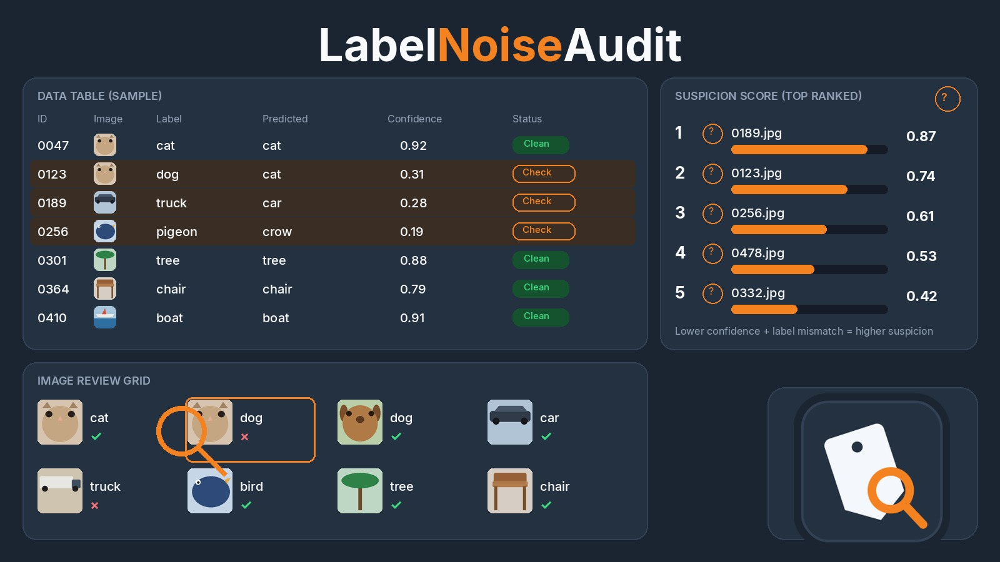

# LabelNoiseAudit

LabelNoiseAudit ranks the rows in a labeled dataset that are most likely to be mislabeled, and it says why. It is a local tool: a small web UI on your computer, plus a command line. There is no account and no cloud backend.

It pairs with [SplitCheck](https://github.com/grummpy/SplitCheck). SplitCheck asks whether a train/test split leaked. LabelNoiseAudit asks whether the labels themselves are wrong. They are different checks.

## Quick start

Install Python 3.11 or newer from [python.org](https://www.python.org/downloads/) if you do not already have it. Then download or clone this repository and double-click the launcher for your computer:

- macOS: `Launch LabelNoiseAudit.command`
- Windows: `Launch LabelNoiseAudit.bat`
- Linux: `./launch.sh`, or the `labelnoiseaudit.desktop` file

The first run creates a `.venv` folder and installs the pinned packages in `requirements.txt`. Later runs start straight away. The app opens at `http://127.0.0.1:8741/` (or the next free port) in your browser. Leave the terminal window open while you use it. Ctrl+C stops it.

In the page, pick a built-in dataset or open a CSV or image folder, then run the audit. The ranked table is the review. Mark each row keep, relabel, or drop, and export a new CSV plus an audit log. The original file is not modified.

## Dev setup

```bash
python3 -m venv .venv
source .venv/bin/activate
pip install -r requirements.txt -r requirements-dev.txt
pip install -e . --no-deps
pytest
ruff check .
```

On Windows, activate with `.venv\Scripts\activate`.

The same entry point serves the UI:

```bash
python -m labelnoiseaudit
python -m labelnoiseaudit serve --no-browser --port 8741
```

## What you can load

**CSV.** Choose the label column and the feature columns. Numeric columns are imputed and scaled, low-cardinality text is one-hot encoded, and long text is TF-IDF. The column kinds are inferred and shown in the UI. The preprocessor is fit inside each cross-validation fold, not on the whole table.

**Images.** Use one folder per class, or a CSV with `path` and `label` columns, or a zip of either. The default features are a color histogram, a 16×16 thumbnail, and HOG. They run on CPU. A pretrained ResNet-18 embedding is optional, off by default, and it does not download weights unless you opt in. See [Optional extras](#optional-extras).

Built-in sets, for a first look: Iris, Wine, and Digits from scikit-learn, a generated field-notes table, and a generated sun/tile image folder. `examples/field_notes.csv` is the same kind of generated text, saved so you can point the command line at a file.

## Command line

```bash
python -m labelnoiseaudit audit \
  --csv examples/field_notes.csv \
  --label topic \
  --features note \
  --out data/field-notes.json

python -m labelnoiseaudit audit --images /path/to/class-folders --out data/images.json

python -m labelnoiseaudit benchmark --seed 42 \
  --output docs/benchmark.json \
  --markdown docs/benchmark.md

python -m labelnoiseaudit export \
  --source examples/field_notes.csv \
  --label topic \
  --decisions decisions.json \
  --out data/cleaned.csv \
  --log data/audit-log.json
```

`data/` is gitignored. Audit JSON is a report, not a replacement for the source file. If `--out` is the source path, the command refuses.

`decisions.json` maps a source row index to an action:

```json
{"0": {"action": "keep"}, "3": {"action": "relabel", "new_label": "garden"}, "4": {"action": "drop"}}
```

## Method

Each audit does three things, all in this repository.

1. **Out-of-fold probabilities.** Stratified K-fold (five folds when every class has at least five rows). Each fold fits a fresh preprocessor on the training rows only, then a logistic regression, and writes probabilities for the held-out rows. Neighbor search uses that same fold: a row is never one of its own neighbors, and the neighbor features were not fit on the row.

2. **Confident-learning scores** (`labelnoiseaudit/scoring.py`). Self-confidence is the probability of the given label. Normalized margin is that probability minus the best other class. The confident joint counts a row under the class that clears its own threshold (the mean self-confidence of rows given that label) and beats the other classes that also clear theirs. The noise rate for a class is the off-diagonal share of that row of the joint. The row score mixes self-confidence, margin, and whether the joint is off-diagonal.

3. **kNN disagreement.** The fraction of nearest neighbors (default 5) whose label differs from the given label. The ensemble score is `0.70 * confident-learning + 0.30 * disagreement`.

A row is marked **Check** when the argmax label disagrees with the given label, or when self-confidence is below that class's threshold and at least half the neighbors disagree. Otherwise it is **Clean**. The reasons on each row are the given label versus the prediction, the confidence and the margin, the neighbor label counts, and the class noise rate.

If [cleanlab](https://github.com/cleanlab/cleanlab) is installed, the audit also asks `find_label_issues` for a cross-check and marks rows it flags. The install is optional. The scores above do not depend on it.

## Benchmark

Seed **42**. Synthetic noise is injected at 5%, 10%, and 20%, both uniform (flip to any other class) and class-conditional (every flipped row in a class goes to the next class). The ranker is scored on whether it puts those flipped rows first.

`k` is the number of injected flips. At that cutoff, precision@k equals recall@k for any ranker. Precision@10% and recall@10% use `k = 10%` of the rows, which is where the two numbers come apart. A random ranking would land near the prevalence (the noise rate) for precision@k, and at 0.5 AUROC.

Regenerate with `python -m labelnoiseaudit benchmark --seed 42 --output docs/benchmark.json --markdown docs/benchmark.md`.

| Dataset | Noise | Rate | k | Precision@k | Recall@k | Precision@10% | Recall@10% | AUROC |
| --- | --- | ---: | ---: | ---: | ---: | ---: | ---: | ---: |
| iris | uniform | 5% | 7 | 1.000 | 1.000 | 0.467 | 1.000 | 1.000 |
| iris | uniform | 10% | 15 | 0.933 | 0.933 | 0.933 | 0.933 | 0.994 |
| iris | uniform | 20% | 32 | 0.781 | 0.781 | 1.000 | 0.469 | 0.968 |
| iris | class_conditional | 5% | 7 | 0.857 | 0.857 | 0.467 | 1.000 | 0.996 |
| iris | class_conditional | 10% | 15 | 0.933 | 0.933 | 0.933 | 0.933 | 0.998 |
| iris | class_conditional | 20% | 32 | 0.844 | 0.844 | 0.933 | 0.438 | 0.966 |
| wine | uniform | 5% | 9 | 1.000 | 1.000 | 0.500 | 1.000 | 1.000 |
| wine | uniform | 10% | 17 | 1.000 | 1.000 | 0.944 | 1.000 | 1.000 |
| wine | uniform | 20% | 38 | 0.921 | 0.921 | 1.000 | 0.474 | 0.982 |
| wine | class_conditional | 5% | 9 | 0.778 | 0.778 | 0.500 | 1.000 | 0.995 |
| wine | class_conditional | 10% | 17 | 0.882 | 0.882 | 0.889 | 0.941 | 0.996 |
| wine | class_conditional | 20% | 38 | 0.842 | 0.842 | 0.944 | 0.447 | 0.970 |
| digits | uniform | 5% | 81 | 0.951 | 0.951 | 0.450 | 1.000 | 0.999 |
| digits | uniform | 10% | 165 | 0.945 | 0.945 | 0.894 | 0.976 | 0.999 |
| digits | uniform | 20% | 372 | 0.962 | 0.962 | 1.000 | 0.484 | 0.997 |
| digits | class_conditional | 5% | 81 | 0.889 | 0.889 | 0.444 | 0.988 | 0.997 |
| digits | class_conditional | 10% | 165 | 0.879 | 0.879 | 0.822 | 0.897 | 0.990 |
| digits | class_conditional | 20% | 372 | 0.806 | 0.806 | 0.917 | 0.444 | 0.956 |
| synthetic_text | uniform | 5% | 7 | 1.000 | 1.000 | 0.438 | 1.000 | 1.000 |
| synthetic_text | uniform | 10% | 15 | 0.933 | 0.933 | 0.875 | 0.933 | 0.998 |
| synthetic_text | uniform | 20% | 34 | 0.941 | 0.941 | 1.000 | 0.471 | 0.995 |
| synthetic_text | class_conditional | 5% | 7 | 0.857 | 0.857 | 0.438 | 1.000 | 0.999 |
| synthetic_text | class_conditional | 10% | 15 | 0.867 | 0.867 | 0.875 | 0.933 | 0.993 |
| synthetic_text | class_conditional | 20% | 34 | 0.912 | 0.912 | 1.000 | 0.471 | 0.976 |

On this run, every setting beat a random ranking: AUROC was above 0.5, and precision@k was above the prevalence. At 5% noise, precision@10% looks lower because the top 10% of rows is wider than the handful of flips; recall@10% stays near 1 when those flips were all retrieved. Iris, wine, and digits are the scikit-learn copies of the public Iris, UCI Wine, and handwritten-digits sets. The text set is generated in `labelnoiseaudit/datasets.py` from topic word lists, with filler and some cross-topic words so the classes overlap a little. It is not a scraped corpus.

The lowest precision@k in the table is wine, class-conditional, 5% (0.778, against a prevalence of about 0.05) and iris, uniform, 20% (0.781). Digits at 20% class-conditional noise is 0.806 precision@k and 0.956 AUROC.

## Tests

```bash
pytest
ruff check .
```

The tests cover a constructed flip that should rank first, repeated seeds, the out-of-fold preprocessor seeing only the training rows of each fold, neighbors that exclude the row itself, detection that beats random, export integrity (including a refusal to overwrite the source), launcher scripts, and an HTTP smoke test bound to 127.0.0.1. `docs/benchmark.json` is checked against a fresh Iris run at 10% uniform noise.

## Privacy

- The server listens on `127.0.0.1` only.
- Uploads, audits, and exports go in the gitignored `data/` directory. `config.toml` is gitignored; `config.example.toml` shows the defaults.
- Audits do not send rows, images, or scores anywhere.
- The first launcher run downloads pinned packages from PyPI. After the virtual environment exists, an audit does not use the network.
- The only later network use is the optional embedding model, and only after you install `requirements-embeddings.txt` and pass `--allow-weight-download` (or tick both boxes in the UI). That download is the PyTorch ResNet-18 weights, not a call to this project.
- Fixtures are synthetic or the public datasets shipped inside scikit-learn. There are no personal emails, addresses, or other private records in the repo.

## Optional extras

```bash
pip install -r requirements-embeddings.txt   # torch, torchvision; weights still require an opt-in
pip install -r requirements-cleanlab.txt     # cross-check only
```

Neither file is installed by the launcher.

## Packaged build

`scripts/build_app.py` is an optional PyInstaller build. Install PyInstaller, then run the script on the operating system you want a bundle for. macOS uses `assets/icon.icns`, Windows uses `assets/icon.ico`. CI does not run this script. The result is still a local server with a console window so you can see the URL and stop it.

## Limitations

- The model is logistic regression. A nonlinear model can rank the same rows differently. Confident learning here is the self-confidence, normalized margin, and confident joint described above. It is not the whole cleanlab library.
- Default image features will not separate fine-grained photo classes the way a trained embedding can. The embedding path was not run in the test environment, because PyTorch is not installed there.
- A class with fewer than two rows cannot be scored. The fold count drops to the size of the smallest class.
- High confidence on the wrong label still happens. The export is a review, not an automatic relabel. Dropped rows are omitted from the cleaned CSV and recorded in the log. Image files are never edited or deleted.
- The macOS launcher was not run on a Mac, and the Windows launcher was not run on Windows. The Linux launcher script is the same setup steps; the server itself was tested on Linux.
- The PyInstaller bundle was not built here.
- `docs/cover.jpg` is a redraw of the dashboard layout (title, table, suspicion bars, review grid, tag-and-magnifier mark) for the README and the icon. The thumbnails in that image are illustrations.

## License

MIT. See [LICENSE](LICENSE).
